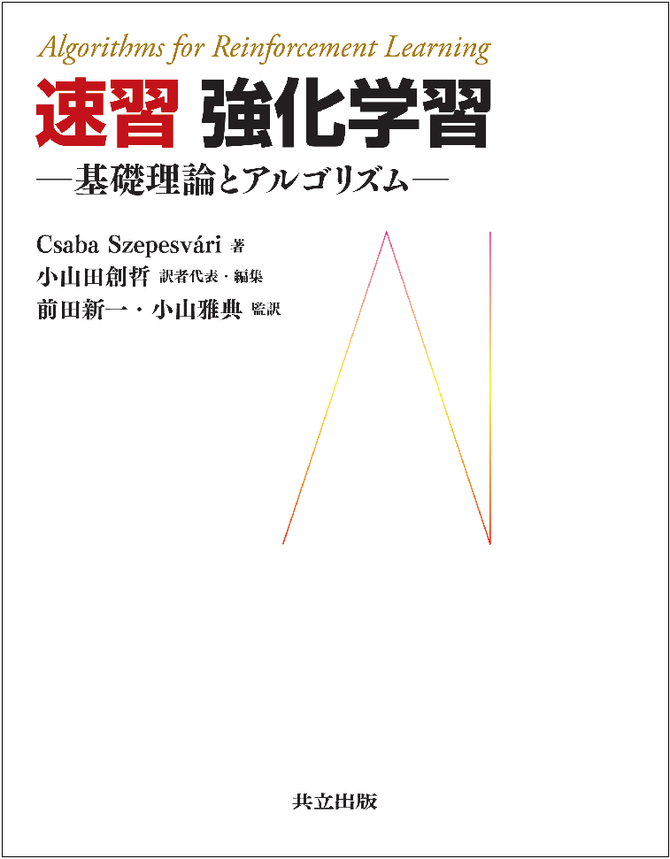
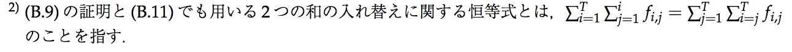

# 速習 強化学習 －基礎理論とアルゴリズム－

「[速習 強化学習 －基礎理論とアルゴリズム－](http://www.kyoritsu-pub.co.jp/bookdetail/9784320124226)（共立出版）」（原著: Csaba Szepesvári "[Algorithms for Reinforcement Learning](http://www.morganclaypool.com/doi/abs/10.2200/S00268ED1V01Y201005AIM009)"）のサポートページです。

## 本書について
訳者まえがきより

> GoogleのAlphaGoによるプロ棋士打破は，人工知能がヒトを超えた学習を行った歴史的出来事として認識された．この事例が象徴的に現わしているように，人の手によって作られた正解例をもとに学習する教師有り学習とは異なり，強化学習ではこれまで人が試したこともないような，人を超える手を生み出すことを可能とした．強化学習は，囲碁などのゲームのほかにも自動運転やロボット制御など制御分野への応用でも注目されている．このように，強化学習は，実社会にインパクトを与える応用が生まれつつあり，機械学習の中でも特にホットな分野といえる．
>
> その一方で，日本語で強化学習を体系的に学べる教科書はまだ多くはない．また，代表的な強化学習の教科書であるSutton and Barto (1998)の邦訳書では，新しいアルゴリズムが十分には掲載されていない．実際，本書に掲載されている約3分の1のアルゴリズムは，Sutton and Barto (1998)では触れられていない．本書の翻訳のきっかけもまさにそこに起因している．今回，特に強化学習を学ぶことに意欲的な若手研究者，実務家，大学院生が集まったことで，本書の勉強会が企画されるのみならず，訳者総勢12名による翻訳作業が始まることとなった次第である．
>
> ここで，本書がどういった本であるかを簡単にご紹介したい．本書は出版当時，トップ会議 (AAAI)のチュートリアルで利用されたり，出版以降わずか数年で 400 弱の引用がされたりといった事実から窺えるように，入門書として広く読まれている良書である．本書の内容は動的計画法などの基本的かつ重要なアルゴリズムから始まり，比較的新しい手法の基礎となる部分が網羅されながら，全体の分量はコンパクトに抑えられている．本書の想定読者は大学生・大学院生であり，特別な前提知識なしに自己完結しており，平易な語り口でアルゴリズムのエッセンスが理解しやすいよう工夫されているため，自習にも適している．翻訳では，この原文のニュアンスを保持したまま，日本語として自然に理解できるよう腐心したため，時には直訳からは出てこないような翻訳も敢えて行った．出版から7年あまり過ぎたことで，カバーされていないアルゴリズムも存在するものの，その多くは本書で掲載されたアルゴリズムをその基礎においている．特に近年の深層学習を利用した強化学習アルゴリズムに，本書で紹介されたアルゴリズムがどのように使われているかを簡単に解説した付録を追加することで，近年の深層学習を利用した強化学習アルゴリズムに対する理解が深まるような工夫を行っている．

## 正誤表
書籍の誤植を発見された方はissueを登録して頂けますと幸いです: https://github.com/rl-tokyo/szepesvari-book/issues

| ページ | 修正前 | 修正後 | 修正反映版 |
| --- | --- | --- | ---- |
| p.90 | 式 **(B.9)** の第一項から | 式 **(B.5)** の第一項から | 第3刷 |
| p.90 |  |  | 第3刷 |
| p.90 | 等比数列の計算と和の入れ替えによって次の等式が成り立つ | 和の入れ替えの恒等式（脚注2）と等比数列の和の公式によって次の等式が成り立つ |第3刷 |
| p.90 | （一行上の修正に伴い、脚注を追加） |  | 第3刷 |
| p.91 | 所望**した**結果が得られる | 所望**の**結果が得られる | 第3刷 |

## 訳者一覧
- **小山田創哲** 株式会社リクルートホールディングス ＜訳者代表・編集＞
- **前田新一** 株式会社 Preferred Networks，博士（理学）＜監訳＞
- **小山雅典** 立命館大学 理工学部数理科学科 助教，博士（数学）＜監訳＞
- **池田春之介** 慶応義塾大学大学院
- **大渡勝己** 東京大学大学院
- **芝慎太朗** 東京大学大学院
- **関根嵩之** 株式会社リクルートホールディングス
- **高山晃一** 株式会社リクルートホールディングス
- **田中一樹** 株式会社ディー・エヌ・エー
- **西村直樹** 株式会社リクルートホールディングス
- **藤田康博** 株式会社 Preferred Networks
- **望月駿一** 株式会社リクルートホールディングス
